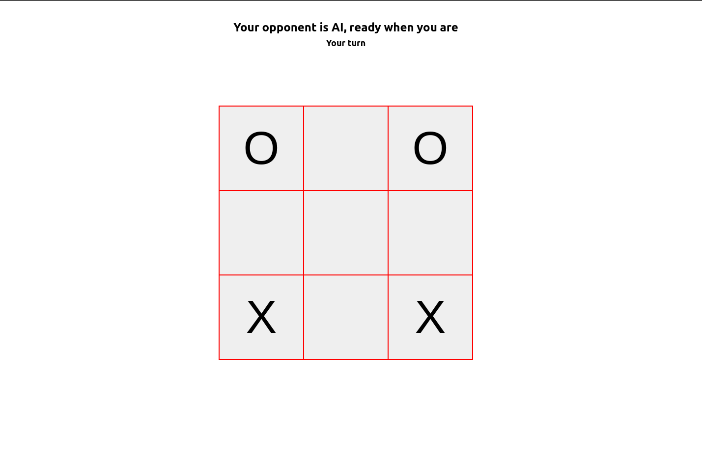

# Tic Tac Toe in React
Simple app that implements the minimax algorithm to play tic tac toe.

**Note: This implementation of the minimax algorithm is not perfect as it lets the human player win sometimes**
**However, I may implement a difficulty setting later and perfect the minimax algo for hardmode**

The libraries used to develop this app are React and OpenLayers

**Feel free to use this code, however kindly share and give reasonable attribution of my work.**
